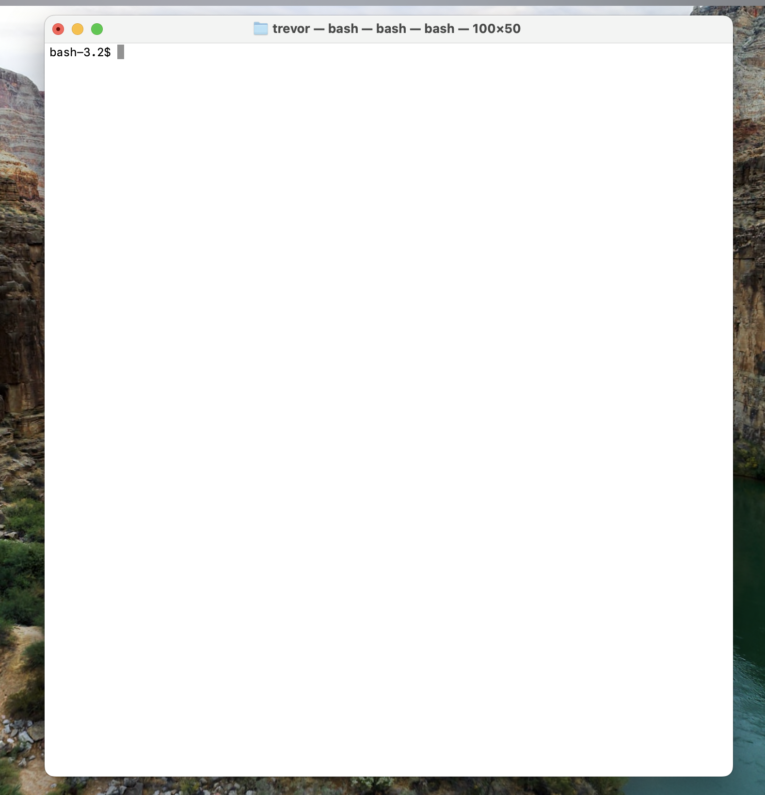
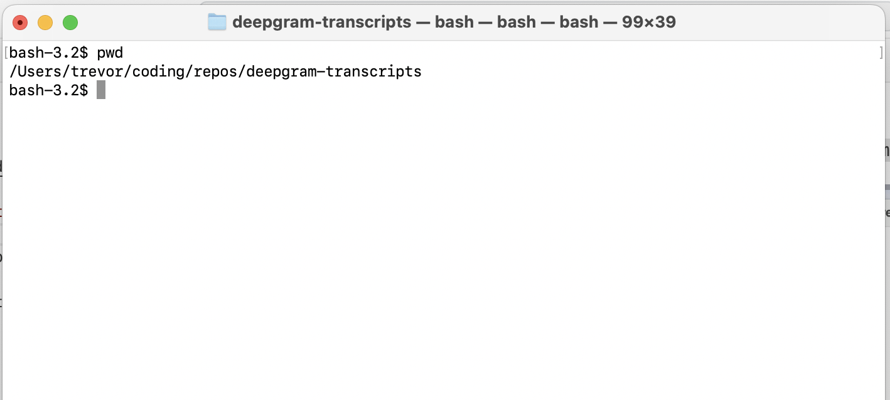
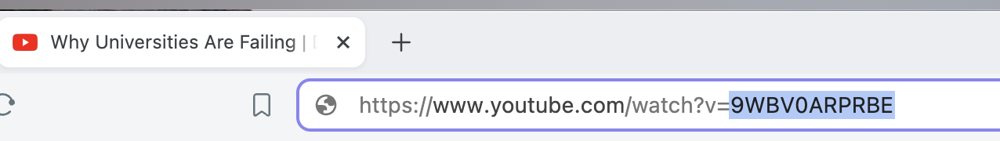

# Getting Started

Download [NodeJS](https://nodejs.org/en)

Download `deepgram-transcripts`

Pick a location to save the project, like `Desktop` or `Documents`

Open the Spotlight Search with `cmd+f` and search for `terminal`



If you saved the project to `Desktop` then run this command
```bash
cd ~/Desktop
```

If you saved the project to `Downloads` then run this command
```bash
cd ~/Downloads
```

This is where my project is located


If you saved it somewhere else, then identify the file path to where it was saved, and replace the file path with where it is located.

Now move into the `deepgram-transcripts` project
```bash
cd deepgram-transcripts
```

Install the dependencies
```bash
npm install
```

Create the `.env` file
```bash
touch .env
```

Save the deepgram-api key into the .env file
```bash
echo "DEEPGRAM_KEY=85b20971b3a90c8a2974e7d3ddbb655b19120950" > .env
```

Go to the YouTube video and get the `video_id` from the URL



The YouTube URL looks like this
```
https://www.youtube.com/watch?v=9WBV0ARPRBE
```

The part that we need is what comes after the `?v=`, which is `9WBV0ARPRBE`

Two values are needed to generate the transcript. The first is the `videoId` which has been identified. The second is the name you want to give the generated transcript.

```bash
--videoId <id>
--fileName <name>
```

Running the command
```bash
node ./main.js --videoId 9WBV0ARPRBE --fileName "doug-wilson-interview"
```

There is an optional command to perform some automated editing, such as removing unwated words, fixing conjunctions, fixing capitalization, and other small fixes. If you want to use this, then instead of running the command above, run the command below to generate the transcript.
```bash
node ./main.js --videoId 9WBV0ARPRBE --fileName "doug-wilson-interview" --updateTranscript true
```

Give it some time to download. The audio file, and the transcript will be placed in a new directory called `outputs`.